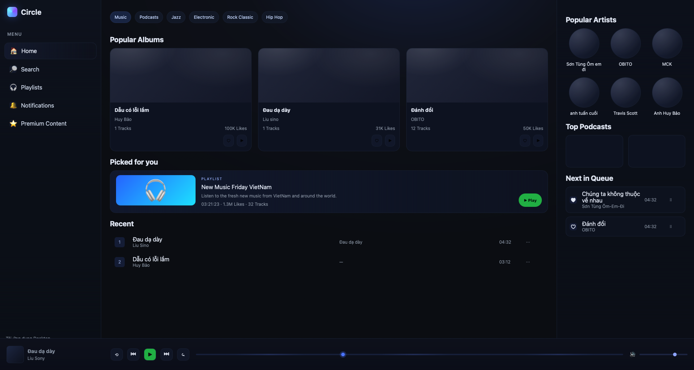

# 🎵 Music Player – HTML & CSS Layout (Ex2)

##  Những update trong Ex2
- Responsive UI: 3 breakpoint (900px, 720px, 540px)
- Transitions: hover cho card, button, track, control
- Animations: pulse cho nút Play, float cho hero artwork, shimmer cho seek bar

## 📁 Cấu trúc
├─ index.html
├─ style.css
└─ assets/
└─ screenshot.png

##  Ảnh giao diện cuối

